# Biped Trajectory Optimization
## NOTE : This project is still in developement
- [Biped Trajectory Optimization](#biped-trajectory-optimization)
 + [Human gait](#human-gait)
    * [Dynamic Walking on sinusoidal terrain](#dynamic-walk-on-sinusoidal-terrain)
    * [Dynamic Walking on staired terrain](#dynamic-walk-on-staired-terrain)
    * [Dynamic Walking on sloped terrain](#dynamic-walk-on-sloped-terrain)
    * [Dynamic Walking on flat terrain](#dynamic-walk-on-flat-terrain)
 + [Ostrich gait](#ostrich-gait)
    * [Dynamic Walking on sinusoidal terrain](#dynamic-walk-on-sinusoidal-terrain)
    * [Dynamic Walking on staired terrain](#dynamic-walk-on-staired-terrain)
    * [Dynamic Walking on sloped terrain](#dynamic-walk-on-sloped-terrain)
    * [Dynamic Walking on flat terrain](#dynamic-walk-on-flat-terrain)
- [Gait Generation for single step](#gait-generation-for-single-step)
  + [using CasADi library in python](#using-casadi-library-in-python)
  + [Trajectory Optimization on some basic systems](#trajectory-optimization-on-some-basic-systems)
    * [cartpole on python using CasADi](#cartpole-on-python-using-casadi)
    * [simple pendulum](#simple-pendulum)
    * [cartpole on C++](#cartpole-on-c)
  + [Passive Walking of 2-link bipedal system](#passive-walking-of-2-link-bipedal-system)

## Human gait
### Dynamic Walking on sinusoidal terrain

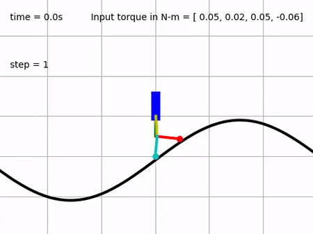
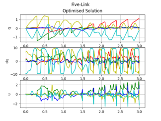 

### Dynamic Walking on staired terrain

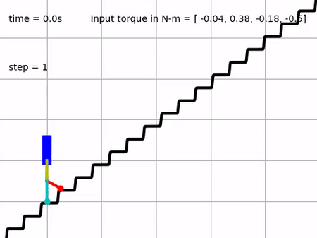
 
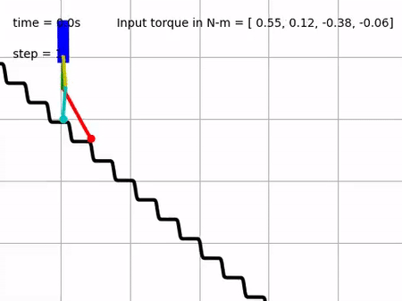

### Dynamic Walking on sloped terrain

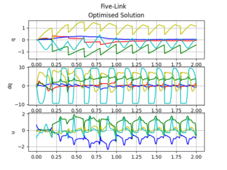 

### Dynamic Walking on flat terrain
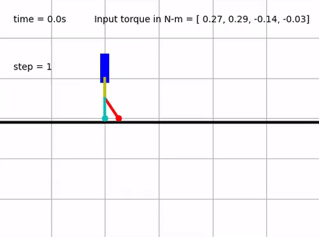
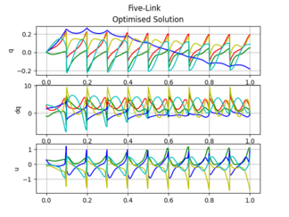 

## Ostrich gait

### Dynamic Walking on sinusoidal terrain

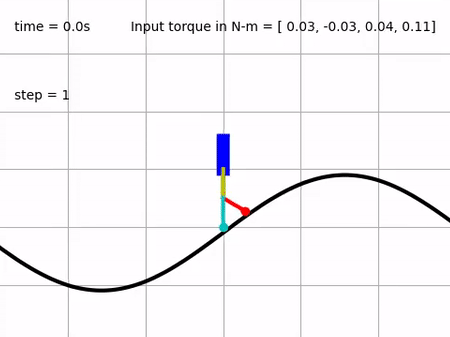
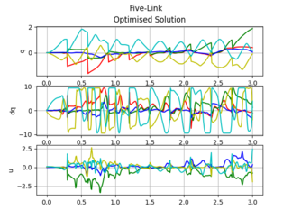 

### Dynamic Walking on staired terrain

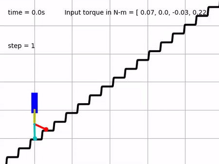
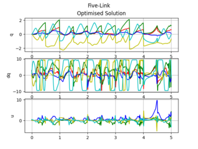 
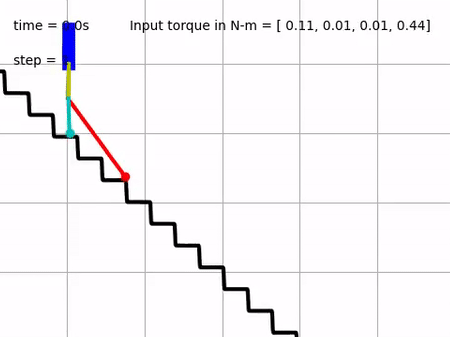

### Dynamic Walking on sloped terrain

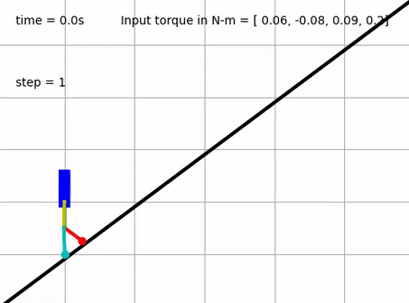
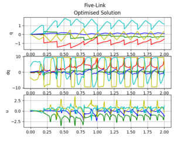 

### Dynamic Walking on flat terrain

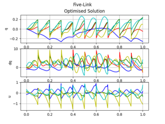 

## Gait Generation for single step
### using CasADi library in python

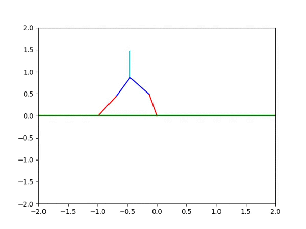 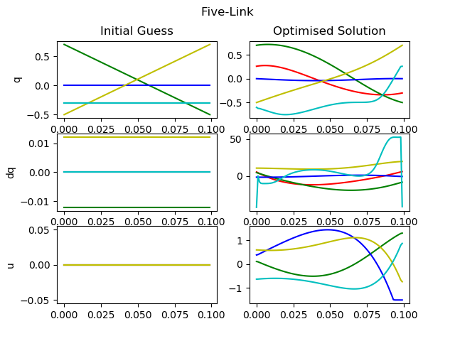

## Trajectory Optimization on some basic systems
### cartpole on python using CasADi

 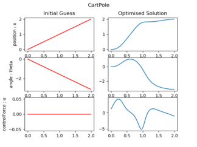

### [simple pendulum](basic-tasks/simple_pendulum.m)

### [cartpole on C++](basic-tasks/cartpole-cpp)

## [Passive Walking of 2-link bipedal system](passive-walker)

