# Biped Trajectory Optimization
## NOTE : This project is still in developement
- [Biped Trajectory Optimization](#biped-trajectory-optimization)
  * [Dynamic Walking on sinusoidal terrain](#dynamic-walking-on-sinusoidal-terrain)
  * [Dynamic Walking on staired terrain](#dynamic-walking-on-staired-terrain)
  * [Dynamic Walking on sloped terrain](#dynamic-walking-on-sloped-terrain)
  * [Dynamic Walking on flat terrain](#dynamic-walking-on-flat-terrain)
  * [Gait Generation for single step](#gait-generation-for-single-step)
    + [using CasADi library in python](#using-casadi-library-in-python)
  * [Trajectory Optimization on some basic systems](#trajectory-optimization-on-some-basic-systems)
    + [cartpole on python using CasADi](#cartpole-on-python-using-casadi)
    + [simple pendulum](#simple-pendulum)
    + [cartpole on C++](#cartpole-on-c)
  * [Passive Walking of 2-link bipedal system](#passive-walking-of-2-link-bipedal-system)

## Dynamic Walking on sinusoidal terrain
### Human gait

 
### Ostrich gait

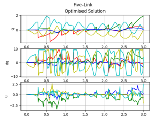 
## Dynamic Walking on staired terrain
### Human gait
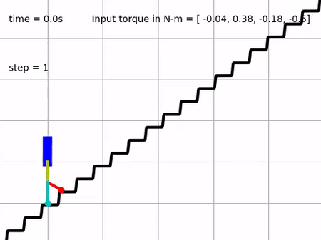
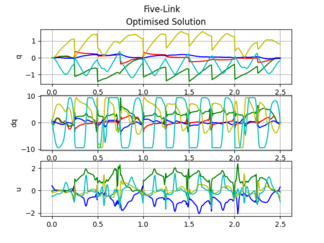 
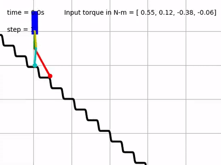
### Ostrich gait
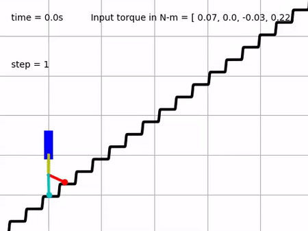
 
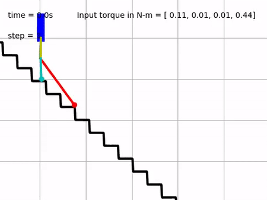
## Dynamic Walking on sloped terrain
### Human gait

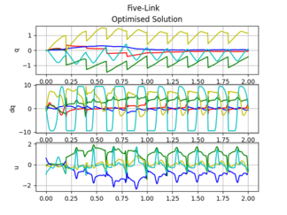 
### Ostrich gait

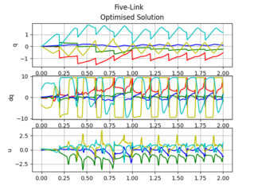 
## Dynamic Walking on flat terrain
### Human gait

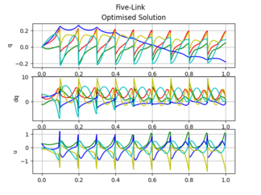 
### Ostrich gait
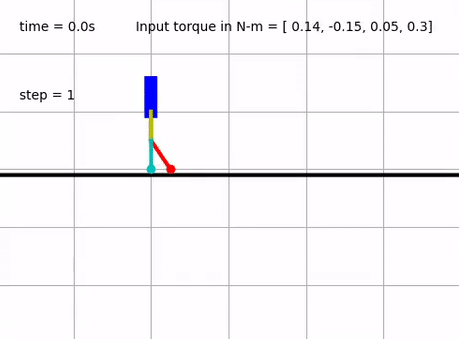
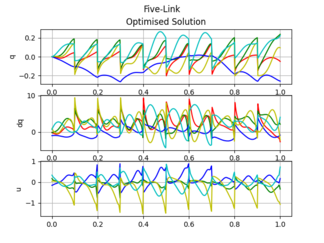 

## Gait Generation for single step
### using CasADi library in python
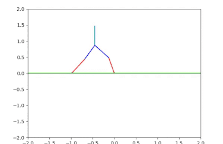 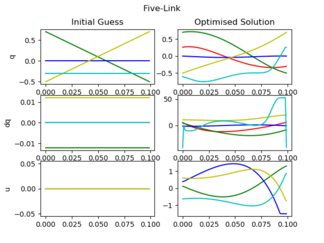

## Trajectory Optimization on some basic systems
### cartpole on python using CasADi

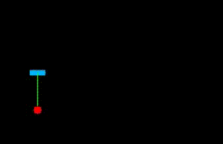 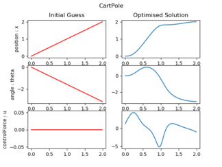

### [simple pendulum](basic_tasks/simple_pendulum.m)

### [cartpole on C++](basic_tasks/cartpole_cpp)

## [Passive Walking of 2-link bipedal system](passive_walker)

